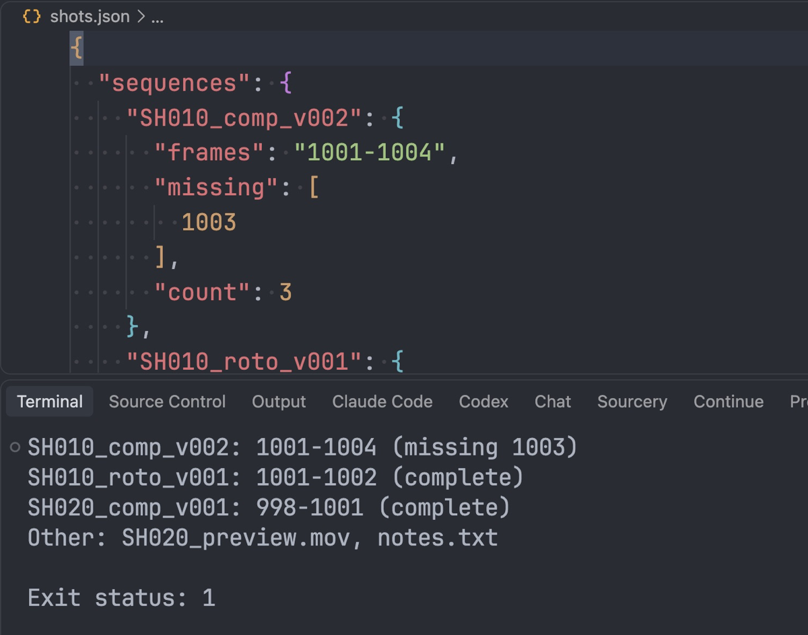

# Capstone — Shot Inventory

You'll combine Chapter 1 into the tool from Lesson 1.1. One string method is new, `join()`, and it is explained where you need it; `isdigit()` comes from Lesson 1.8. Point the tool at a messy folder, and it sorts the files into sequences, finds the holes, lists what doesn't belong, prints a report, and saves the inventory as JSON. It reads the folder and never changes it.

## The brief

Open `src/chapter_01/lesson_12.py` and write three functions. You can import your own earlier work, such as `from chapter_01.lesson_07 import format_run`, or copy what you need.

**1. `inventory(folder)`** returns a dict for the regular files directly inside `folder`:

```text
inventory("docs/chapters/01-shot-inventory/sample/dump")
→ {
    "sequences": {
      "SH010_comp_v002": {"frames": "1001-1004", "missing": [1003], "count": 3},
      "SH010_roto_v001": {"frames": "1001-1002", "missing": [], "count": 2},
      "SH020_comp_v001": {"frames": "998-1001", "missing": [], "count": 4},
    },
    "other": ["SH020_preview.mov", "notes.txt"],
  }
```

- A **frame image** is a `.exr` or `.dpx` file, in any case, named `SEQUENCE.FRAME.ext`, as in Lesson 1.3, where `FRAME` is digits only (`isdigit()`, as in Lesson 1.8). Group frame images by sequence, whatever their extension.
- `"frames"` is the range from the sequence's first frame to its last, written as in Lesson 1.7.
- `"missing"` lists the frames missing *between* the first and the last, sorted.
- `"count"` is the number of distinct frames in the sequence.
- Every other file goes in `"other"`, sorted. Subfolders are skipped.

**2. `report_lines(result)`** turns that dict into lines for a person, sequences in sorted order, then the other files:

```text
SH010_comp_v002: 1001-1004 (missing 1003)
SH010_roto_v001: 1001-1002 (complete)
SH020_comp_v001: 998-1001 (complete)
Other: SH020_preview.mov, notes.txt
```

- Several missing frames are joined by `", "`, such as `(missing 1003, 1007)`.
- The other files are joined by `", "` too.
- The last line is `Other: none` when there are no other files.

`", ".join(texts)` puts `", "` between the strings of a list: `", ".join(["1003", "1007"])` gives `"1003, 1007"`. It takes only text, so turn each frame into text with `str()` first.

**3. `main(args)`** for the command `shot-inventory FOLDER OUTPUT`:

| Situation | Prints | Returns |
|---|---|---|
| Not exactly two arguments | `usage: shot-inventory FOLDER OUTPUT` | `2` |
| `FOLDER` isn't an existing folder | `error: FOLDER is not a folder` | `2` |
| No sequence has missing frames | the report lines, and saves the inventory to `OUTPUT` as JSON (Lesson 1.10) | `0` |
| Some sequence has missing frames | the same | `1` |

Save `OUTPUT` outside `FOLDER`. The tool doesn't skip its own file, so a second run would list it under other files.

`1` means the tool ran fine and found a problem, so another program can tell "frames are missing" from "the command was used wrong". Python also exits with `1` when an error is not caught, but then it prints a traceback, which tells the two apart. Add the guard, as in Lesson 1.11.

Check your work:

```console
academy test 1 12
```

When the checks pass, run it yourself:

```console
uv run python -m chapter_01.lesson_12 docs/chapters/01-shot-inventory/sample/dump shots.json
```

```text
SH010_comp_v002: 1001-1004 (missing 1003)
SH010_roto_v001: 1001-1002 (complete)
SH020_comp_v001: 998-1001 (complete)
Other: SH020_preview.mov, notes.txt
```



The screenshot shows a completed implementation. The terminal report is for a person; `shots.json` stores the same facts for another program. Frame `1003` appears in both as missing. The exit code is `1` because the tool found missing frames, not because it failed to run.

## Plan before you code

!!! question "Think"

    Which lesson answers each step: listing the files, telling frames from other files, grouping by sequence, finding the holes, writing the range, saving the result, and running from the terminal?

??? success "Answer"

    - Listing the folder: `list_files` (Lesson 1.9).
    - Frames versus other files, and taking names apart: `split_frame_name` (Lesson 1.3).
    - Grouping by sequence: `group_by_sequence` (Lesson 1.8) gives each sequence's frames, each frame once and sorted, whatever its extension. It skips every other name, so you still collect the names for `"other"` yourself, with the same two tests: `split_frame_name` returns `None`, or the frame part isn't digits.
    - The frames between first and last, and the missing ones: `frame_list` and `missing_frames` (Lessons 1.5 and 1.6).
    - The range, such as `1001-1004`: `format_run` (Lesson 1.7).
    - Saving the inventory: `save_json` (Lesson 1.10).
    - `main`, exit codes, and the guard: Lesson 1.11.

Run it on the sample, then make a copy of the sample folder, change it, and predict the report before you run the tool again.

## What next

Open the `shots.json` you saved: any program can now read your inventory. Module 5 of the full course shows how to let an AI model answer questions about data like this, such as "which shot is incomplete?", using only the facts your code produced.
