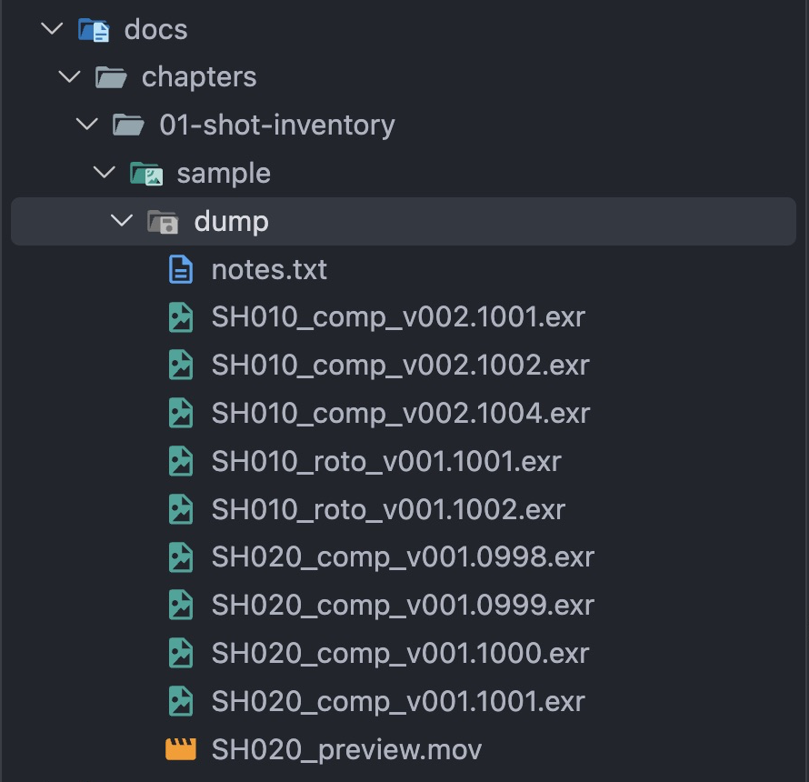

# Lesson 1.1 — Names Carry Data

Imagine a production in a hurry. Artists on several shots have been saving their image files into one shared folder. Someone has to answer simple questions, and nobody can: which shots are in here? Is anything missing? Which version is the newest? The files aren't the problem. The problem is that nobody has read what their **names** already say.

## A filename is a record

A **shot** is one continuous piece of a film, such as `SH010`. Each shot is a series of still images, **frames**, numbered in order. The number labels the picture; it doesn't count from 1. Studios often start at 1001, so a shot can grow at the front: `SH020` starts at `0998`. Different people work on the same shot: a compositor (`comp`) builds the final picture, and a roto artist (`roto`) traces outlines. The kind of work is the **task**: `comp` or `roto`. Each time they deliver, the **version** goes up: `v001`, `v002`. A studio names every frame file by one rule:

```text
SH010_comp_v002.1001.exr
│     │    │    │    └── extension: the file type
│     │    │    └─────── frame number, padded to four digits
│     │    └──────────── version
│     └───────────────── task
└─────────────────────── shot
```

Everything before the frame number identifies a **sequence**: all the frames of one shot, task, and version. So the name alone says which shot, which task, which delivery, and which picture in the series.

## The folder

The sample folder, `docs/chapters/01-shot-inventory/sample/dump/` in your project, contains:

```text
SH010_comp_v002.1001.exr    SH020_comp_v001.0998.exr
SH010_comp_v002.1002.exr    SH020_comp_v001.0999.exr
SH010_comp_v002.1004.exr    SH020_comp_v001.1000.exr
SH010_roto_v001.1001.exr    SH020_comp_v001.1001.exr
SH010_roto_v001.1002.exr    SH020_preview.mov
notes.txt
```



Open the same folder in VS Code's Explorer to inspect the names yourself. The sample `.exr` files are placeholders, not real images.

!!! question "Think"

    `SH010_comp_v001.1001.exr` and `SH010_comp_v002.1001.exr` show the same frame of the same shot. Why do they belong to different sequences?

??? success "Answer"

    They are different deliveries of the work. Mixing them would put pictures from two versions into one series, so the version is part of the sequence's name. Only the frame number changes from one frame to the next; the shot, task, and version stay the same for every frame of a sequence.

!!! question "Think"

    Look at the sample folder. Which sequences does it hold, which frames are missing inside a sequence, and which files are not frames?

??? success "Answer"

    Three sequences: `SH010_comp_v002` (frames 1001, 1002, 1004), `SH010_roto_v001` (1001, 1002), and `SH020_comp_v001` (`0998` to `1001`). Frame 1003 of `SH010_comp_v002` is missing: the numbers jump from 1002 to 1004. `SH020_preview.mov` and `notes.txt` aren't frames; keep them, but report them separately. `notes.txt` is worth reading: it explains the hole.

!!! question "Think"

    Why is frame 1003 of `SH010_comp_v002` reported missing, but frame 1000 is not?

??? success "Answer"

    The folder only shows where each sequence starts and ends. A gap between the first and last frame is clearly a hole. Nothing in the folder says the shot should start earlier, so frame 1000 isn't missing; it may never have existed.

You did by eye what the rest of this chapter teaches Python to do, for any folder, in a fraction of a second.
