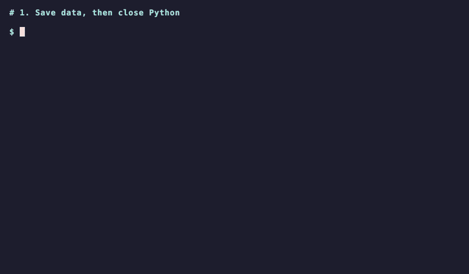

# Lesson 1.10 — JSON as Memory

A report printed in the terminal is gone when the window closes. A note in a text file is memory for people, but a program can't read "SH010 comp is missing 1003" reliably. **JSON** is memory for people *and* programs: plain text, readable in any editor, with a structure every language can load.

## Python data ↔ JSON text

`json.dumps` turns dictionaries, lists, strings, numbers, `True`/`False`, and `None` into JSON text; `json.loads` turns it back:

```python
import json

shot = {"sequence": "SH010_comp_v002", "frames": [1001, 1002, 1004], "complete": False}
text = json.dumps(shot, indent=2)
print(text)
print(json.loads(text) == shot)
```

```text
{
  "sequence": "SH010_comp_v002",
  "frames": [
    1001,
    1002,
    1004
  ],
  "complete": false
}
True
```

`indent=2` makes it readable. JSON writes `false` and `null` where Python writes `False` and `None`.

## Files

`json.dump(data, file)` and `json.load(file)` do the same with an open file; the assignment uses these two. Always give the encoding, so the file reads the same on every computer:

```python
import json

shot = {"sequence": "SH010_comp_v002", "frames": [1001, 1002, 1004]}
with open("shots.json", "w", encoding="utf-8") as file:
    json.dump(shot, file, indent=2)

with open("shots.json", encoding="utf-8") as file:
    loaded = json.load(file)
print(loaded == shot)
```

```text
True
```

`with` closes the file when the block ends, even if something goes wrong. To read, open the file without `"w"`.



The recording runs the example in two separate Python processes. The first closes after saving; the second loads the file without needing the first process's variables.

!!! question "Think"

    Why is a JSON file a better place for the inventory than the terminal output, even if the text looks similar?

??? success "Answer"

    Because the next program can load it without guessing: a dashboard, a script that emails the coordinator, or an AI assistant that answers questions about it. The terminal text is for one person, once.

## Assignment

Open `src/chapter_01/lesson_10.py`.

**1. `save_json(data, path)`** writes `data` to `path` as UTF-8 JSON, indented by 2 spaces.

> Expected: `save_json({"shot": "SH010"}, path)` writes:
>
> ```json
> {
>   "shot": "SH010"
> }
> ```

**2. `load_json(path)`** returns the data from a JSON file.

> Expected: `load_json(path)` → `{"shot": "SH010"}`

Check your work:

```console
academy test 1 10
```
