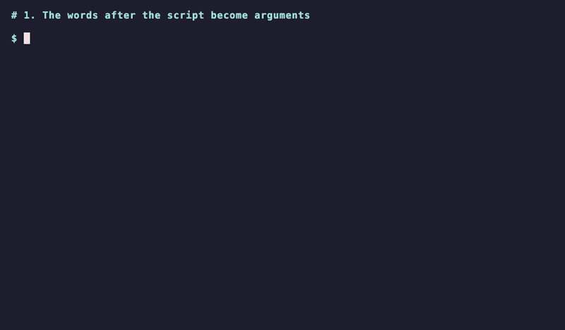

# Lesson 1.11 — A Script You Can Run

Your functions work when you call them in Python. A coordinator doesn't write Python: they type a command with a folder name and read the answer. This lesson turns a function into a **script**: a file you run from the terminal, which reads what you typed after the command.

## The words after the command

Create a folder `work` in the `module-0` folder for your own experiments, and save this in it as `args.py`:

```python
import sys

script, *args = sys.argv
print(script)
print(args)
```

Run it with two words after the file name:

```console
uv run python work/args.py SH010 comp
```

```text
work/args.py
['SH010', 'comp']
```

`sys.argv` is the list of words on the command line, starting with the script itself. `script, *args = sys.argv` unpacks it as in Lesson 1.8: `script` gets the first word, and the `*` in front of `args` collects all the rest into a list, which is empty when you type no arguments.

## `main` returns a status

Put the work in a `main(args)` function that takes those words and **returns** a number, the program's **exit code**: `0` means everything went fine, anything else means a problem, and `2` usually means the command was used wrong. Python also exits with `1` when a script stops on an uncaught error. So `1` from a script that uses its own codes can mean either result, and only the traceback tells them apart.

`count-frames` in the usage message is the name a coordinator would type once the tool is installed. For now, you run the file with `uv run`.

```python
def main(args):
    if len(args) != 1:
        print("usage: count-frames FOLDER")
        return 2
    print(f"checking {args[0]}")
    return 0


# print shows the returned number here; the guard hands it to sys.exit instead
print(main(["dump"]))
print(main([]))
```

```text
checking dump
0
usage: count-frames FOLDER
2
```

## The guard

A script ends with the entry-point **guard**:

```python
if __name__ == "__main__":
    script, *args = sys.argv
    sys.exit(main(args))
```

`__name__` is `"__main__"` only when you run the file directly. When the checks import the file, it holds the module's name instead, so nothing runs. `sys.exit` ends the program and hands `main`'s number to the terminal as the exit code, where other programs can read it. The name `main` is a habit: Python runs it only because the guard calls it.



The counter in the recording is already implemented. Its printed answer and exit code are separate: `9 image files` is for the person; `0` tells another program the run succeeded. With no folder argument, it prints usage and exits with `2`. Importing it prints neither because the guard keeps the command from running. The recording uses Bash, where `echo $?` shows the previous command's exit code. In PowerShell, use `$LASTEXITCODE` instead.

Once your own counter passes its checks, you can repeat the recording from the `module-0` folder:

```console
uv run python -m chapter_01.lesson_11
echo $?
uv run python -c "import chapter_01.lesson_11"
```

The first command prints `usage: count-frames FOLDER`, and `echo $?` prints `2`. The import prints nothing.

!!! question "Think"

    Why does `main` take the words as an argument instead of reading `sys.argv` itself?

??? success "Answer"

    So a test can call `main(["some/folder"])` with any words it likes and check the result, without starting a new program. The guard is the only line that reads the real command line.

!!! question "Think"

    This file runs correctly from the terminal, but `academy test 1 11` runs no checks and reports `SystemExit: 2`. Why?

    ```python
    def main(args):
        ...


    script, *args = sys.argv
    sys.exit(main(args))
    ```

??? success "Answer"

    The last two lines have no guard, so they run whenever the file is imported. The checks import it, so `main` gets the test runner's words, and `sys.exit` stops the test run before any check executes. Put the two lines under `if __name__ == "__main__":`.

## Assignment

Open `src/chapter_01/lesson_11.py` and write `main(args)` for a command that counts image files:

| Situation | Prints | Returns |
|---|---|---|
| Not exactly one argument | `usage: count-frames FOLDER` | `2` |
| The argument isn't an existing folder | `error: FOLDER is not a folder` | `2` |
| Otherwise | `N image files`, counting `.exr` and `.dpx` directly inside, in any letter case | `0` |

You can reuse your Lesson 1.9 `image_files` to count: `from chapter_01.lesson_09 import image_files`. Then add the guard, so running the file calls `main` and exits with its result.

> Expected on the sample folder: prints `9 image files`, returns `0`

Check your work:

```console
academy test 1 11
```

When the checks pass, run it yourself from the `module-0` folder:

```console
uv run python -m chapter_01.lesson_11 docs/chapters/01-shot-inventory/sample/dump
```

```text
9 image files
```

`-m` runs the file by its import name, `chapter_01.lesson_11`, the same name the checks import, instead of by its path.
