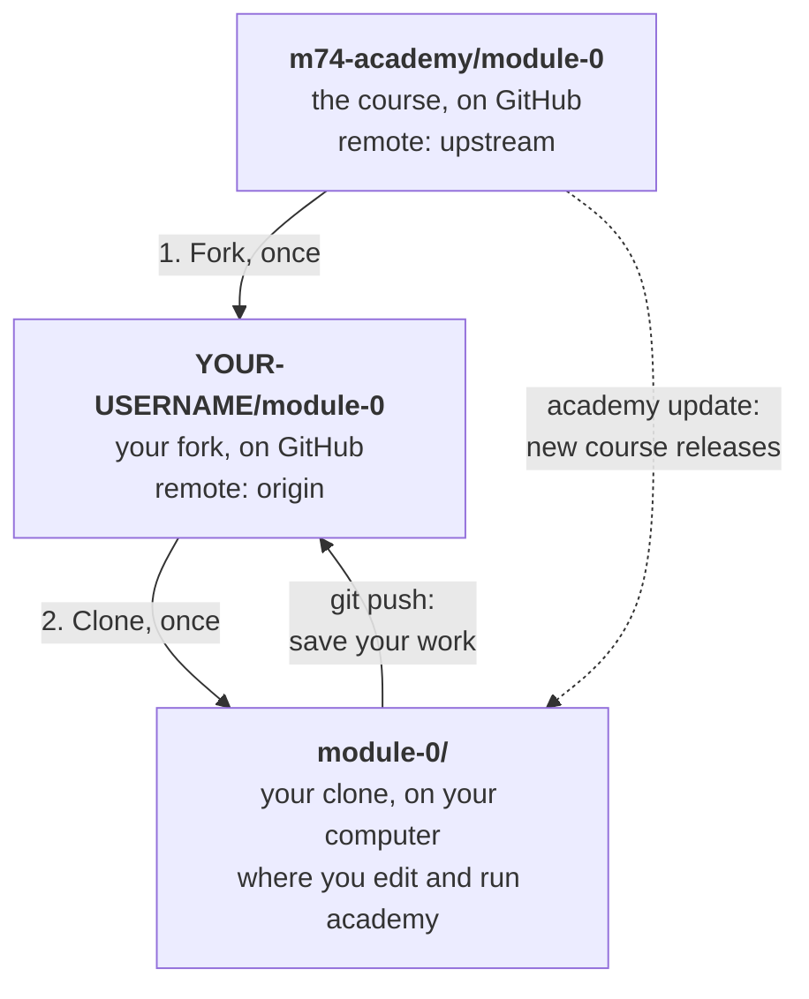
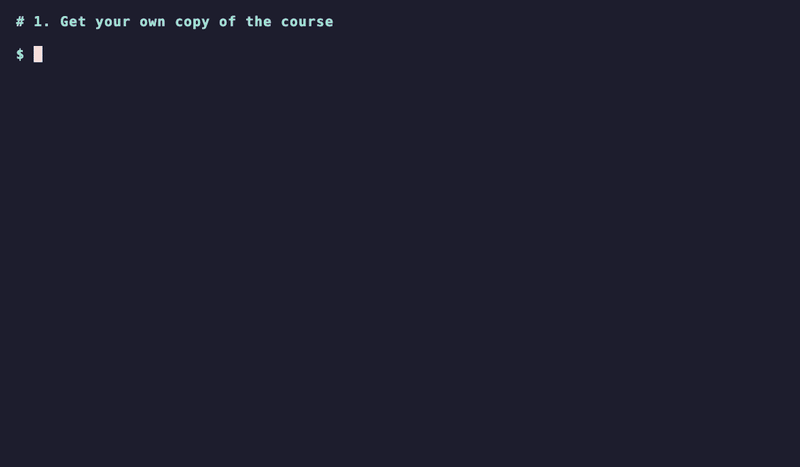
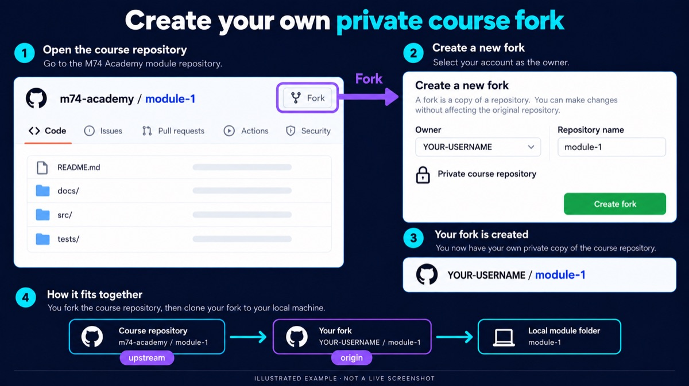
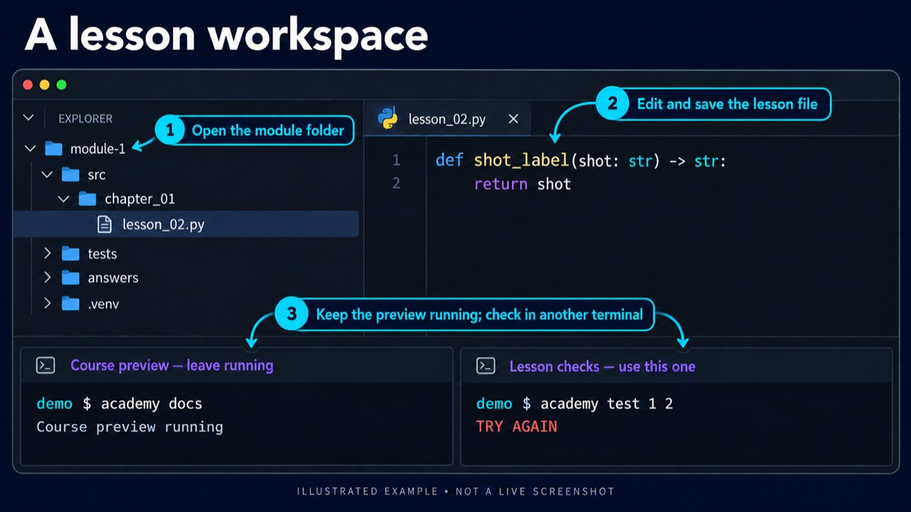

# Set up the module

The Module 0 README starts with one command that does all of this:

```console
gh repo fork m74-academy/module-0 --clone
```

This guide explains what it does, and how to do the same by hand. It uses Module 0; for another module, replace `module-0` with its name, for example `module-1`.



- **Fork:** your own copy of the course on GitHub. You push your work there.
- **Clone:** that copy downloaded to your computer, in a `module-0` folder.
- **Remotes:** `origin` is your fork; `upstream` is the course. `academy update` gets course updates from `upstream`.

You need [the software installed](install-uv-and-git.md) first, with `gh auth login` done.

## Watch setup



Each step starts on a clear screen. `academy health` ends with `Setup looks good.`; a `FAIL` line would come with its fix.

## By hand, in the browser



Illustrated example; GitHub's layout may differ.

1. Open the module repository, for example [m74-academy/module-0](https://github.com/m74-academy/module-0), and click **Fork**, then **Create fork**. The result is `YOUR-USERNAME/module-0`.
2. Clone your fork. With GitHub CLI this also adds `upstream`:

   ```console
   gh repo clone YOUR-USERNAME/module-0
   ```

   With Git alone, clone and add `upstream` yourself:

   ```console
   git clone https://github.com/YOUR-USERNAME/module-0.git
   cd module-0
   git remote add upstream https://github.com/m74-academy/module-0.git
   ```

3. Check the remotes from inside the folder:

   ```console
   git remote -v
   ```

   ```text
   origin    https://github.com/YOUR-USERNAME/module-0.git (fetch)
   origin    https://github.com/YOUR-USERNAME/module-0.git (push)
   upstream  https://github.com/m74-academy/module-0.git (fetch)
   upstream  https://github.com/m74-academy/module-0.git (push)
   ```

## Open it in VS Code

1. **File → Open Folder** and choose the module folder, for example `module-0`. Open the folder, not a single file.
2. The folder's `.vscode/extensions.json` lists the extensions the course needs. When VS Code offers to install them, click **Install**. If it doesn't, open the Extensions view (**View → Extensions**) and install **Python** (by Microsoft).
3. **Terminal → New Terminal**. It starts in the module folder, where every course command runs.



Illustrated example; the layout and exercise are simplified. `academy docs` keeps running in one terminal; click **+** in the terminal panel for a second one, for `academy test` and Git.

## Set up the project

In the module folder:

```console
uv sync --locked
```

`uv` reads three files that come with the module:

| File | Says |
|---|---|
| `.python-version` | which Python |
| `pyproject.toml` | the project and its packages |
| `uv.lock` | the exact tested versions |

It downloads Python if needed and creates `.venv/`. `--locked` stops without changing anything if the lock file doesn't match.

Then check everything:

```console
academy health
```

Every required check prints `OK`, and the last line says `Setup looks good.` A `FAIL` line comes with a fix. `WARN` and `INFO` lines are advice.

If every import in the editor has a red underline, open the Command Palette (**Ctrl+Shift+P**, **Cmd+Shift+P** on macOS) → **Python: Select Interpreter** → choose `.venv`. This only affects the editor; `academy` always uses the right Python.

## Run Python

The module has its own Python in `.venv/`, with your lesson code installed. Run it through `uv`, from the module folder:

| To | Run |
|---|---|
| Try lines one at a time | `uv run python`, type them, then `exit()` |
| Try your lesson function | `uv run python`, then for example `from chapter_01.lesson_02 import frame_filename` |
| Run a file | `uv run python FILE.py` |
| Run a lesson as a script | `uv run python -m chapter_01.lesson_11 ARGUMENTS` |

After you save a change to a lesson, exit `uv run python` and start it again: it loads your file only once. A plain `python` may start another Python, or none, without your lesson code. In VS Code, **Run Python File** uses the module's Python once the interpreter is set to `.venv`.

## When a check fails

Read the `E` lines of the failure: in `assert A == B`, `A` is what your function returned and `B` is what the check expected.

To see a value inside your function, add a `print` and check again. Its output appears under **Captured stdout call**, but only when a check fails:

```text
E     - Shot: SH010
E     + SH010
----------------------------- Captured stdout call -----------------------------
shot = 'SH010'
```

`print("shot =", repr(shot))` shows quotes and stray spaces that a plain `print` hides. Remove the `print` when you're done. To try a value by hand, [run Python](#run-python) and import your function.

## Fix the remotes of an existing clone

`academy health` checks the remotes. If it says **origin is the course, not your fork** (you cloned the course instead of your fork), keep the folder and your work:

```console
gh repo fork --remote
git push -u origin main
```

`gh repo fork --remote` creates your fork (or finds it), renames the course remote to `upstream`, and adds your fork as `origin`. `git push` then saves your work there.

If it says **upstream remote is missing** or **upstream is … not the course**, run the fix it prints, for example:

```console
git remote add upstream https://github.com/m74-academy/module-0.git
```

Run `academy health` again to confirm.

Back to **Start here** in the [Module 0 README](https://github.com/m74-academy/module-0#start-here) for the next step.
