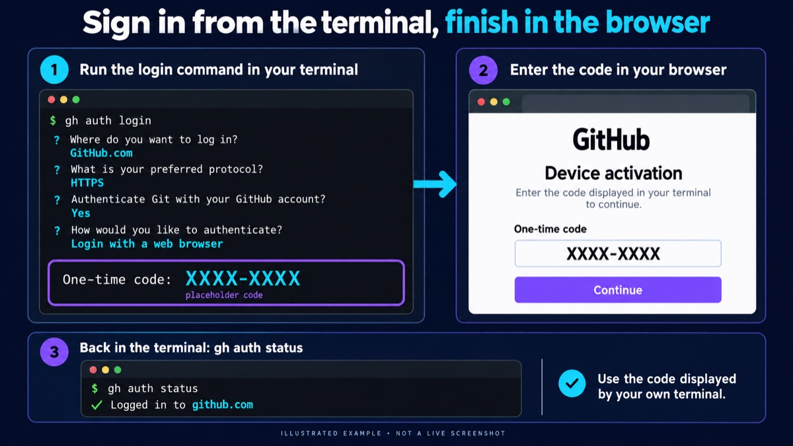

# Install the software

Do this once per computer, before your first lesson. Every M74 Academy module uses the same setup.

| Tool              | Why                                                                     |
| ----------------- | ----------------------------------------------------------------------- |
| VS Code           | Your text editor                                                        |
| `uv`                | Runs Python and every course command; takes care of Python as well      |
| Git               | Gets the course and its updates, and saves your work                    |
| GitHub CLI (`gh`) | Signs your computer in to GitHub, so Git can fork and update the course |
| `academy` command | Checks your lessons, opens the course, and checks your setup            |

> You also need a free [GitHub account](https://github.com/signup). Enrolled in a paid module? Use the account your instructor invited: those course repositories are private.

## 1. Install VS Code

> We will use VS Code's terminal to run commands, and its editor to write Python code. You can use another editor, but the course is tested with VS Code.

1. Download it from [code.visualstudio.com](https://code.visualstudio.com/) and install it.
2. To open a terminal inside VS Code, choose **Terminal → New Terminal**. Type the commands below there.

You install the **Python** extension later, when you [open the module folder](fork-clone-setup.md#open-it-in-vs-code).

## 2. Install `uv`

macOS and Linux:

```console
curl -LsSf https://astral.sh/uv/install.sh | sh
```

Windows:

```console
powershell -ExecutionPolicy ByPass -c "irm https://astral.sh/uv/install.ps1 | iex"
```

> These come from the [official `uv` page](https://docs.astral.sh/uv/getting-started/installation/); if commands change, follow the instructions there.

Create a new terminal instance, then check:

```console
uv --version
```

It prints a version number. `command not found` (on Windows: `uv : The term 'uv' is not recognized…`) means the terminal started before the install: close it and open a new one. On Windows, quit VS Code (**File → Exit**) and open it again.

## 3. Install Git

| System  | How                                                                                                                                                                                      |
| ------- | ---------------------------------------------------------------------------------------------------------------------------------------------------------------------------------------- |
| macOS   | Run `git --version` and click **Install** when macOS offers the command line developer tools                                                                                             |
| Windows | Download [Git for Windows](https://git-scm.com/install/) and run the installer with its default choices. |
| Linux   | Use your package manager, for example `sudo apt install git` on Ubuntu                                                                                                                   |

Open a new terminal and check:

```console
git --version
```

Then tell Git who you are. Use your name and an email from your GitHub account (**Settings → Emails**; the `…@users.noreply.github.com` address shown there keeps your email private). Every commit records them:

```console
git config --global user.name "Your Name"
git config --global user.email "you@example.com"
```

## 4. Install GitHub CLI and sign in

Git needs your GitHub sign-in to fork the course and push your work. GitHub CLI sets that up.

| System  | How                                                                                                                                                                                                                                                                                                        |
| ------- | ---------------------------------------------------------------------------------------------------------------------------------------------------------------------------------------------------------------------------------------------------------------------------------------------------------- |
| macOS   | Download the **macOS installer** from [cli.github.com](https://cli.github.com/) and open it. If you already use [Homebrew](https://brew.sh/), `brew install gh` works too                                                                                                                                  |
| Windows | Run `winget install --id GitHub.cli` in the terminal; the first time, winget asks you to accept its terms: type `Y` and press Enter. Or download the **Windows installer** from [cli.github.com](https://cli.github.com/). |
| Linux   | Follow the instructions for your distribution on [cli.github.com](https://cli.github.com/)                                                                                                                                                                                                                 |

Open a new terminal, then sign in:

```console
gh auth login
```

Answer the questions:

1. Where do you use GitHub? **GitHub.com**
2. Preferred protocol? **HTTPS**
3. Authenticate Git with your GitHub credentials? **Yes**
4. How to authenticate? **Login with a web browser**. Note the 8-character code it shows, press **Enter** to open the browser, and type the code there. (Ctrl+C in the terminal cancels the login.)

Check:

```console
gh auth status
```



Illustrated example; GitHub's layout may differ.

It says you are logged in to github.com.

## 5. Install the `academy` command

```console
uv tool install git+https://github.com/m74-academy/academy-cli
```

If `uv` says its tool folder is not on your `PATH`, run `uv tool update-shell`, then open a new terminal.

The same `academy` command works in every module; `academy update` keeps it and the course current.

## Check

In a **new** terminal, each of these prints a version or a status, not an error:

```console
uv --version
git --version
gh auth status
academy --version
```

`academy --help` lists every command with examples; `academy` alone shows the same.

Your computer is ready. Next: [set up the module](fork-clone-setup.md), or follow **Start here** in its README, for example the [Module 0 README](https://github.com/m74-academy/module-0#start-here).
